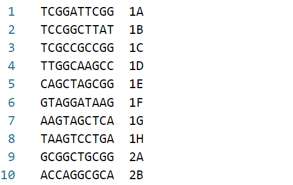
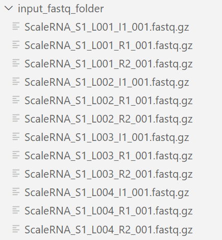
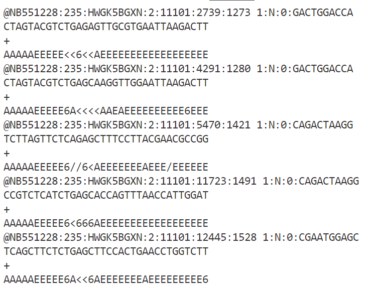

# Demultiplex Tool for sci-RNA-seq

This tool is used to prepare sci-RNA sequencing data for putting into STAR solo.

## Table of Contents

- [Function](#function)
- [Installation](#installation)
- [Input Format](#input_format)
- [Output Format](#output_format)

## Function

This tool is used to prepare sci-RNA sequencing data for putting into STAR solo. It takes in FastQ files of R1, R2, and I1 reads and creates two new FastQ files: one with the barcodes, and one with the cDNA transcripts. It corrects the barcodes according to barcode repositories and mispositioning of nearby barcodes.

It contains two files:
- Demultiplex_tool_main.sh: change paths to barcode repositories, input and output folders, and set parameters. Run this script.
- Demultiplex_tool.py: main script.

## Installation

Step-by-step instructions on how to get the project up and running:

1. Clone the repository:
    ```bash
    git clone https://github.com/yourusername/yourproject.git # change link
2. Navigate to project directory:
    ```bash
    cd yourproject # change name
3. Navigate to bash script:
    ```bash
    cd demultiplex_tool_main.sh
4. Change paths and parameters as needed.
5. Install dependencies (this example uses a conda environment)
    ```bash
    conda install gzip tqdm difflib numpy
6. Run bash script
    ```bash
    bash demultiplex_tool_main.sh

## Input_Format

- Barcode repositories: plain text files (not gzipped). One barcode per line. Additional text after whitespace is fine. No leading or trailing whitespace.
    - Ligation
    - RT
    - P7



- Input FastQ folder: path to folder with input FastQ files. Files should be gzipped. File names should be formatted as: ScaleRNA_S[sample #]_L[three digit lane #]\_[I1, R1, or R2]_001.fastq.gz. Ex for lane 10, sample 3, I1 read: ScaleRNA_S3_L010_I1_001.fastq.gz. FastQ files should contain ID line, sequence line, + line, and quality score line for each record. No leading or trailing whitespace. 
    - R1 sequence: ligation, linker, UMI, RT
    - R2 sequence: cDNA
    - I1 sequence: p7





- Output FastQ folder: path to empty folder. If not empty, ensure file names don't include: I1.fastq.gz, R1.fastq.gz, R2.fastq.gz, Barcode.fastq, Transcripts.fastq, Warning.fastq. 

- Parameters: all integers
    - num_samples: number of samples present in input FastQ folder (or number of samples desired for processing)
    - num_lanes: number of lanes present in input FastQ folder (or number of lanes desired for processing)
    - r1_sequence_length: length of R1 sequence read
    - i1_sequence_length: length of I1 sequence read
    - rt_warn_threshold: if less than x percent confident on RT barcode classification, add record to warning file
    - lig_warn_threshold: if less than x percent confident on ligation barcode classification, add record to warning file
    - umi_start_index: where UMI starts in R1 sequence. Length of ligation barcode + length of linker. Uses index 0
    - umi_length: number of nucleotides in UMI
    - r2_sequence_length: length of R2 sequence read
    - id_character_count: length of ID (if unsure, an integer larger than length of ID and less than 1000)

## Output_Format

All output in defined output folder.

- I1.fastq.gz: combined I1 records for all samples and lanes
- R1.fastq.gz: combined R1 records for all samples and lanes
- R2.fastq.gz: combined R2 records for all samples and lanes
- Barcode.fastq: FastQ file with ID from R1 read, sequence, +, quality score of sequence
    - Sequence: RT barcode + Ligation barcode + P7 barcode + UMI
- Transcripts.fastq: FastQ file with R1 read ID, cDNA, +, quality score of cDNA
- Warning.fastq: FastQ file with records that failed warning thresholds. R1 read ID, sequence, +, quality score of sequence
    - Sequence: Barcode that failed threshold (can be multiple); Best guess RT barcode + Ligation barcode + P7 barcode + UMI