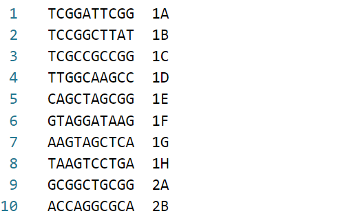
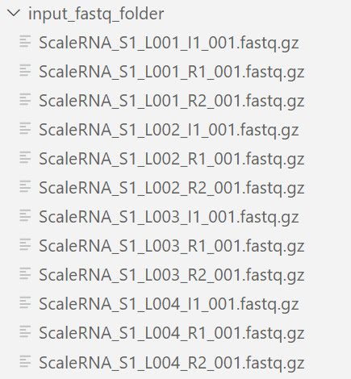
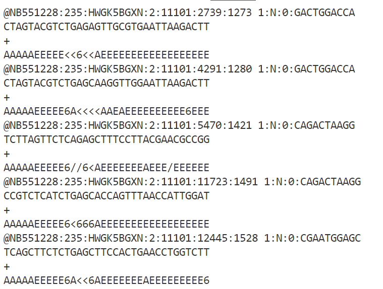

# Demultiplex Tool for sci-RNA-seq

This tool is used to prepare sci-RNA sequencing data for putting into STAR solo.

## Table of Contents

- [Function](#function)
- [Installation](#installation)
- [Running Program](#running-program)
- [Input Format](#input_format)
- [Output Format](#output_format)

## Function

This tool is used to prepare sci-RNA sequencing data for putting into STAR solo. It takes in FastQ files of R1, R2, and I1 reads and creates two new FastQ files: one with the barcodes, and one with the cDNA transcripts. It corrects the barcodes according to barcode repositories and mispositioning of nearby barcodes.

It contains ten files:
- set_params.sh: sets all variables, including paths and parameters for tool.
- demultiplex_tool_main.sh: controls sbatch scripts for tool. Run this script.
- demultiplex_tool.py: main script for tool function.
- change_names.sh: changes names of chunk folders.
- check_inputs.py: validates input files.
- create_chunks.sh: processes long input files and creates smaller chunks.
- chunk_metrics.py: aggregate metrics from each chunk and create metrics file.
- process_chunks.py: processes each chunk using demultiplex_tool.py.
- setup.py: helper file to set up cython function.
- optimized_functions.pyx: cython file to implement functions in C++.

## Installation

Step-by-step instructions on how to get the project up and running:

1. Clone the repository:
    ```bash
    git clone https://github.com/manya-lalwani/sciRNA-demultiplex-tool
2. Navigate to tool directory:
    ```bash
    cd sciRNA-demultiplex-tool
3. Install dependencies using conda or pip (gzip, pigz, tqdm, numpy, sys, re, os, FileLock, difflib, Cython)
    ```bash
    conda install gzip tqdm pigz numpy FileLock Cython
4. In tool directory, compile Cython code by running
    ```bash
    python setup.py build_ext --inplace

## Running Program

1. Setting parameters
    - Navigate to tool directory and open set_params.sh
    - Set input and output fastq folders to path/to/folder (see below for input and output format)
    - Set demultiplex tool folder to path to cloned tool directory
    - Set paths to barcode repositories (see below for format)
    - Set sbatch parameters
        - job_name will be included in sbatch jobs and in file names
        - account to run sbatch job with
        - partition to run sbatch job on
        - short_time_length should be around 30 minutes or less
        - long_time_length depends on file_length (525 million data points ~ 3 hours to be safe (will be less))
        - nodes available to run on (will be used for chunk processing if chunked data)
        - mail_type = NONE, ALL (see sbatch guidelines)
        - mail_user is email address to send job updates to (see sbatch guidelines)
        - num_cpus = number of cpus per node available (will be used for chunk processing if chunked data)
        - num_cpus_file_handling = number of cpus to use for breaking file into chunks (more cpus will work faster)
    - Set running parameters
        - delete extra files after running (False for debugging, True for simplication of output)
        - aggregate data/metrics from different chunks (True/False)
        - fastq_prefix, using format: {fastq_prefix}_S1_L001_I1_001.fastq.gz (for file type I1 as an example)
        - no scoring (0 for scoring/false, 1 for no scoring/true): if 0, guesses will be made for ambiguous barcodes and guesses will be scored. Top percent_guess_to_keep guesses will be kept in output Fastq files. If 1, all ambiguous barcodes will be removed from output Fastq files. 
        - chunk (true/false): if true, please only provide one sample and lane (3 files total). Use true for long files. if false, all data will be processed as one chunk.
        - max_records_per_chunk (recommended around 500,000)
        - batch_size (default 1, recommend 1000 for large datasets, range should be 1-4000)
    - Set parameters for data: all integers
        - num_samples: number of samples present in input FastQ folder (or number of samples desired for processing)
        - num_lanes: number of lanes present in input FastQ folder (or number of lanes desired for processing)
        - r1_sequence_length: length of R1 sequence read
        - i1_sequence_length: length of I1 sequence read
        - percent_guess_to_keep: percent of guesses to maintain in final output Fastqs
        - umi_start_index: where UMI starts in R1 sequence. Length of ligation barcode + length of linker. Uses index 0
        - umi_length: number of nucleotides in UMI
        - r2_sequence_length: length of R2 sequence read
        - id_character_count: length of ID (if unsure, an integer larger than length of ID and less than 1000)
    - Other parameters (do not change)
        - paths to scripts
        - constants for submitting jobs with 1 node or 1 CPU
2. Running
    ```bash
    bash path/to/demultiplex_tool_main.sh
    # or if desired to continue running when terminal closes
    nohup path/to/demultiplex_tool_main.sh &

## Input Format

- Barcode repositories: plain text files (not gzipped). One barcode per line. Additional text after whitespace is fine. No leading or trailing whitespace.
    - Ligation
    - RT
    - P7



- Input FastQ folder: path to folder with input FastQ files. Files should be gzipped. File names should be formatted as: ScaleRNA_S[sample #]_L[three digit lane #]\_[I1, R1, or R2]_001.fastq.gz. Ex for lane 10, sample 3, I1 read: ScaleRNA_S3_L010_I1_001.fastq.gz. FastQ files should contain ID line, sequence line, + line, and quality score line for each record. No leading or trailing whitespace. 
    - R1 sequence: ligation, linker, UMI, RT
    - R2 sequence: cDNA
    - I1 sequence: p7





- Output FastQ folder: path to empty folder. If not empty, ensure file names don't include: I1.fastq.gz, R1.fastq.gz, R2.fastq.gz, Barcode.fastq, Transcripts.fastq, Warning.fastq. 

## Output_Format

All output in defined output folder.

- I1.fastq.gz: combined I1 records for all samples and lanes
- R1.fastq.gz: combined R1 records for all samples and lanes
- R2.fastq.gz: combined R2 records for all samples and lanes
- Barcode.fastq: FastQ file with ID from R1 read, sequence, +, quality score of sequence
    - Sequence: RT barcode + Ligation barcode + P7 barcode + UMI
- Transcripts.fastq: FastQ file with R1 read ID, cDNA, +, quality score of cDNA
- Metrics.txt: text file with metrics from dataset

Or if chunked data:
- Aggregate_Metrics.txt: text file with metrics from entire dataset
- Barcode.fastq.gz
- Transcripts.fastq.gz
